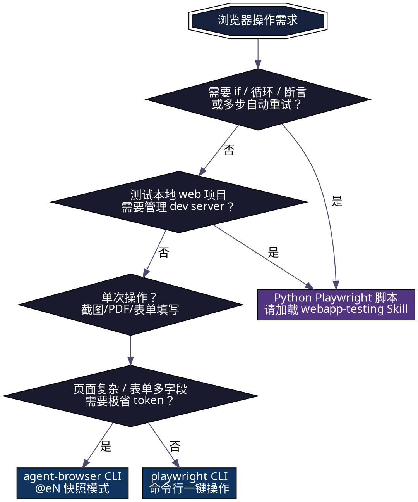

# 🌐 浏览器自动化

两套 CLI + 一套 Python 库，用决策树选对工具。

> **Python Playwright 脚本模式**（`webapp-testing` Skill）独立保留，用于需要断言/重试/编程逻辑的复杂场景。

---

## 🧭 决策树：我该用哪个？



**铁律：**
1. 能用 CLI → 不用脚本（agent-browser 优先，最省 token）
2. 需要编程逻辑 → 必须 `webapp-testing` Skill
3. 不确定 → 默认 `agent-browser`

---

## 📖 模块 A：agent-browser CLI

> 仓库：<https://github.com/vercel-labs/agent-browser> | v0.27.0 | Rust 原生

**核心哲学：无障碍树快照 + @eN 引用**

```
snapshot -i → 返回无障碍树（200-400 token，比 DOM 省 ~98%）
每个元素有 @eN 编号 → 后续操作用 @eN 引用
```

### 标准工作流

```bash
# 1. 打开页面
agent-browser open "https://example.com/login"

# 2. 获取快照，识别元素
agent-browser snapshot -i
# 输出:
# @e1 link "首页"
# @e2 textbox "邮箱"    ← 记住这个
# @e3 textbox "密码"    ← 记住这个
# @e4 button "登录"     ← 记住这个

# 3. 操作元素
agent-browser fill @e2 "user@example.com"
agent-browser fill @e3 "password123"
agent-browser click @e4

# 4. 等待并确认
agent-browser wait --load networkidle
agent-browser screenshot
```

### 命令速查

| 分类 | 命令 | 说明 |
|:---|:---|:---|
| **导航** | `open <url>` | 打开页面 |
| | `back` / `forward` / `reload` | 前进后退刷新 |
| **快照** | `snapshot -i` | 无障碍树（含 @eN 编号） |
| | `snapshot --full` | 全页快照 |
| **交互** | `click @eN` | 点击 @eN 元素 |
| | `fill @eN "text"` | 清空并填入 |
| | `type @eN "text"` | 键入（不清空） |
| | `press Enter` | 按键 |
| | `select @eN "val"` | 下拉选择 |
| | `check @eN` / `uncheck @eN` | 勾选/取消 |
| | `hover @eN` | 悬停 |
| | `scroll down 300` | 滚动 |
| | `upload @eN "./file.pdf"` | 上传文件 |
| **获取** | `get text @eN` | 元素文本 |
| | `get value @eN` | 输入框值 |
| | `get title` / `get url` | 页面标题/URL |
| | `get count "selector"` | 元素数量 |
| **截图** | `screenshot` | 可视区域 |
| | `screenshot --full` | 全页 |
| | `screenshot --annotate` | 标注 @eN |
| | `pdf output.pdf` | 导出 PDF |
| **等待** | `wait "selector"` | 等待元素 |
| | `wait 2000` | 等待毫秒 |
| | `wait --text "Success"` | 等待文本 |
| | `wait --load networkidle` | 网络空闲 |
| **查找** | `find text "登录" click` | 按文本查找并点击 |
| | `find role button click` | 按角色查找 |
| | `find label "邮箱" fill "a@b.c"` | 按标签填表 |
| | `find placeholder "搜索" type "hello"` | 按占位符输入 |
| **高级** | `eval "document.title"` | 执行 JS |
| | `batch "cmd1" "cmd2"` | 批量执行 |
| | `open URL --new-tab` | 新标签页 |
| | `cookie set/get/clear` | Cookie 操作 |

### WSL2 注意

```bash
# 如 Chrome 未自动安装：
export AGENT_BROWSER_EXECUTABLE_PATH="~/.agent-browser/chrome-install/opt/google/chrome/google-chrome"
```

---

## 📖 模块 B：playwright CLI

> 官方 Playwright 命令行 | `npx playwright --version`

### 命令速查

| 命令 | 说明 |
|:---|:---|
| `playwright open [url]` | 打开浏览器 |
| `playwright cr [url]` | Chromium |
| `playwright ff [url]` | Firefox |
| `playwright wk [url]` | WebKit |
| `playwright screenshot <url> <file>` | 截图保存 |
| `playwright pdf <url> <file>` | 保存 PDF |
| `playwright codegen [url]` | 录制操作生成 Python 代码 |
| `playwright install` | 安装浏览器 |
| `playwright install-deps` | 安装系统依赖 |
| `playwright show-trace [file]` | 查看 trace |

### 常用组合

```bash
# 快速截图
playwright screenshot https://example.com output.png

# 生成 PDF
playwright pdf https://example.com page.pdf

# 录制操作并生成自动化脚本
playwright codegen https://example.com

# 用特定浏览器打开
playwright cr https://example.com    # Chromium
playwright ff https://example.com    # Firefox
```

> 💡 需要断言、重试、多步骤逻辑？→ 加载 `webapp-testing` Skill，用 Python Playwright 脚本。

---

## ⚠️ 常见陷阱

| 陷阱 | 正确做法 |
|:---|:---|
| 操作后不复用快照 | 每次 DOM 变化后重新 `snapshot -i` |
| 用 agent-browser 做复杂断言 | 改用 Python Playwright 脚本 |
| playwright CLI 做多步流程 | 它只做单次操作，多步用 agent-browser 或 Python |
| 忘记 `--load networkidle` 等待 | 动态页面必须等待 JS 加载完成 |
| CSS 选择器不可靠时硬猜 | 用 `find` 命令的语义查找替代 |
